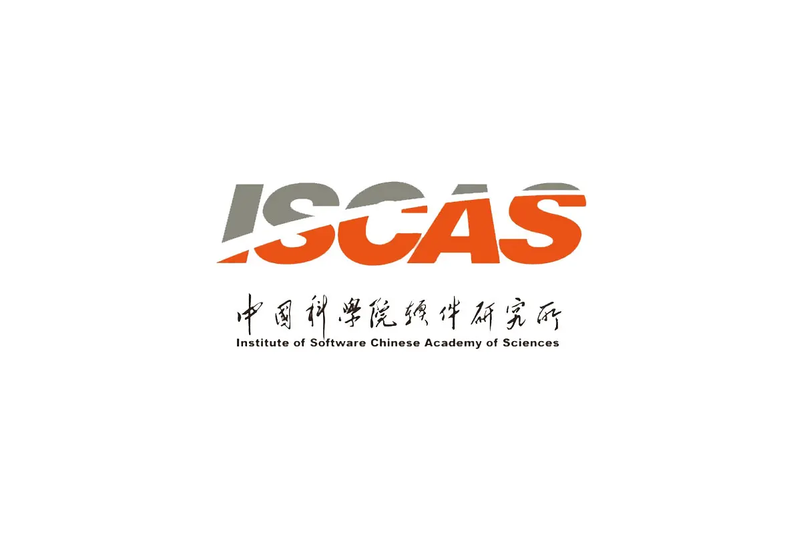

# 中国科学院软件研究所 (Institute of Software Chinese Academy of Sciences, ISCAS)

- [智能软件研究中心](https://isrc.iscas.ac.cn/)
- [吴敬征-中国科学院大学-UCAS](https://people.ucas.ac.cn/~jingzheng)
- [凌祥-中国科学院大学-UCAS](https://people.ucas.edu.cn/~lingxiang)
- [中科院软件所｜凌祥课题组招生](https://securenexuslab.github.io/2025/06/12/iscas/)

## 2025/06/15
> 来自中科院软件所公众号推送

### 招生要求
课题组对学生生源学校没有限制，非常欢迎基本能力足够优秀的学生联系，满足以下条件的加分（非必须）：

✅ 自驱力强

✅ 对软件安全有兴趣

✅ 对硬件安全有兴趣

✅ 有一定的Coding能力

✅ 对科研有兴趣

### 优劣势分析:
1. 虽然离实习时间还有一年的时间，但目前我在二进制方向还没有很大的进展
2. 初步掌握编译型语言(C/C++)和脚本语言(Python)，同时学习了8086下的汇编语言，有一定的Coding和代码阅读能力
3. 我虽然愚笨但是愿意踏实和努力，尽管我在两个月的时间内不一定能完成什么科研或者工程项目，但是能够在二进制安全和科研方向积累经验
4. 因为没有高中生前往软件所实习的前例，也没有做科研的经历，在准备面试方面或许会有所欠缺

### 技能/知识补充：
1. 结合在独角鲸-朱雀-悟空代码安全大模型引擎计划助理背景，将LLM基础按照学习路线图过一遍
2. 针对《数据结构（C语言版）》补充算法相关
3. “一生一芯”预学习阶段数电和寒假一个月在深圳理工大学学习操作系统相关
4. 计算机组成原理